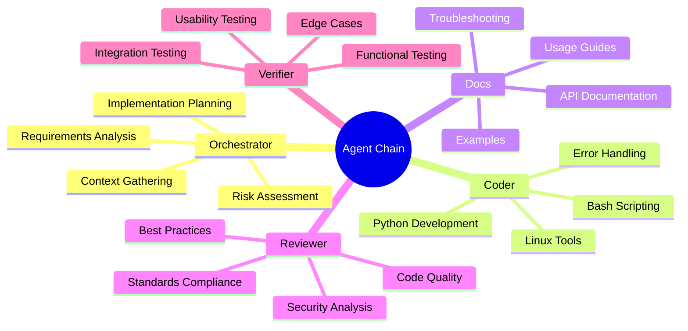
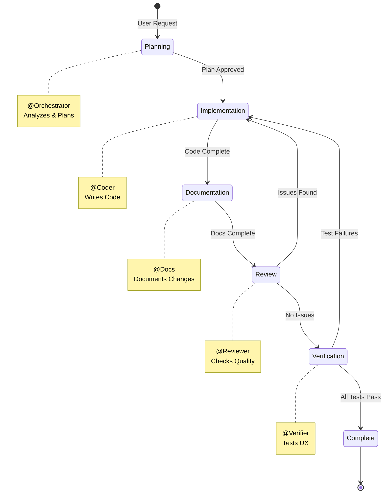

# Agent Workflow Visualization

## Linear Flow (Happy Path)

```mermaid
graph LR
    A[User Request] --> B[@Orchestrator]
    B -->|🚀 Plan Created| C[@Coder]
    C -->|📝 Code Complete| D[@Docs]
    D -->|🔍 Docs Ready| E[@Reviewer]
    E -->|✅ Approved| F[@Verifier]
    F -->|🎉 Verified| G[Complete]
    
    style A fill:#e1f5ff
    style B fill:#fff3cd
    style C fill:#d1ecf1
    style D fill:#d4edda
    style E fill:#f8d7da
    style F fill:#e7e7ff
    style G fill:#c3e6cb
```

## Full Flow with Feedback Loops

```mermaid
graph TB
    A[User Request] --> B[@Orchestrator<br/>Requirements & Planning]
    B -->|🚀 Start Implementation| C[@Coder<br/>Linux Implementation]
    B -->|📝 Document Only| D[@Docs<br/>Documentation]
    C -->|📝 Generate Docs| D
    D -->|🔍 Code Review| E[@Reviewer<br/>Quality & Security]
    E -->|✅ User Verification| F[@Verifier<br/>QA & Testing]
    E -->|🔄 Issues Found| C
    F -->|🐛 Fix Issues| C
    F -->|🎉 Complete| G[Done]
    
    style A fill:#e1f5ff,stroke:#333,stroke-width:2px
    style B fill:#fff3cd,stroke:#333,stroke-width:2px
    style C fill:#d1ecf1,stroke:#333,stroke-width:2px
    style D fill:#d4edda,stroke:#333,stroke-width:2px
    style E fill:#f8d7da,stroke:#333,stroke-width:2px
    style F fill:#e7e7ff,stroke:#333,stroke-width:2px
    style G fill:#c3e6cb,stroke:#333,stroke-width:2px
```

## Agent Roles & Responsibilities



## Handoff Matrix

| From Agent | To Agent | Condition | Button Label |
|------------|----------|-----------|--------------|
| Orchestrator | Coder | Implementation needed | 🚀 Start Implementation |
| Orchestrator | Docs | Documentation only | 📝 Document Existing Code |
| Coder | Docs | Code complete | 📝 Generate Documentation |
| Docs | Reviewer | Docs ready | 🔍 Code Review |
| Reviewer | Verifier | Code approved | ✅ User Verification |
| Reviewer | Coder | Issues found | 🔄 Back to Coder |
| Verifier | Orchestrator | All passed | 🎉 Complete |
| Verifier | Coder | Issues found | 🐛 Issues Found - Back to Coder |

## State Transitions



## Tool Access by Agent

```mermaid
graph TD
    subgraph "Read-Only Agents"
        A[@Orchestrator]
        B[@Verifier]
    end
    
    subgraph "Edit Agents"
        C[@Coder]
        D[@Docs]
        E[@Reviewer]
    end
    
    subgraph "Tools"
        T1[search]
        T2[fetch]
        T3[githubRepo]
        T4[usages]
        T5[edit]
    end
    
    A --> T1
    A --> T2
    A --> T3
    A --> T4
    
    B --> T1
    
    C --> T5
    C --> T1
    C --> T4
    
    D --> T1
    D --> T4
    D --> T5
    
    E --> T1
    E --> T4
    E --> T5
    
    style A fill:#fff3cd
    style B fill:#e7e7ff
    style C fill:#d1ecf1
    style D fill:#d4edda
    style E fill:#f8d7da
```

## Workflow Examples

### Example 1: New Feature (Implementation Path)
```
User → @Orchestrator "Add support for Spotify podcast transcription"
       ↓ (creates plan)
@Orchestrator → @Coder (🚀 Start Implementation)
       ↓ (implements feature)
@Coder → @Docs (📝 Generate Documentation)
       ↓ (documents feature)
@Docs → @Reviewer (🔍 Code Review)
       ↓ (reviews & approves)
@Reviewer → @Verifier (✅ User Verification)
       ↓ (tests & passes)
@Verifier → @Orchestrator (🎉 Complete)
```

### Example 2: Documentation Only (Skip Implementation)
```
User → @Orchestrator "Analyze and document how batch-transcribe.sh works"
       ↓ (analyzes existing code)
@Orchestrator → @Docs (📝 Document Existing Code)
       ↓ (creates comprehensive docs)
@Docs → @Reviewer (🔍 Code Review)
       ↓ (reviews docs)
@Reviewer → @Verifier (✅ User Verification)
       ↓ (verifies docs accuracy)
@Verifier → @Orchestrator (🎉 Complete)
```

### Example 3: Bug Fix with Issues
```
User → @Coder "Fix error handling in batch-transcribe.sh"
       ↓ (fixes bug)
@Coder → @Docs (📝 Generate Documentation)
       ↓ (updates docs)
@Docs → @Reviewer (🔍 Code Review)
       ↓ (finds issues)
@Reviewer → @Coder (🔄 Back to Coder - Fix Issues)
       ↓ (fixes issues)
@Coder → @Docs (📝 Generate Documentation)
       ↓ (updates docs)
@Docs → @Reviewer (🔍 Code Review)
       ↓ (approves)
@Reviewer → @Verifier (✅ User Verification)
```
